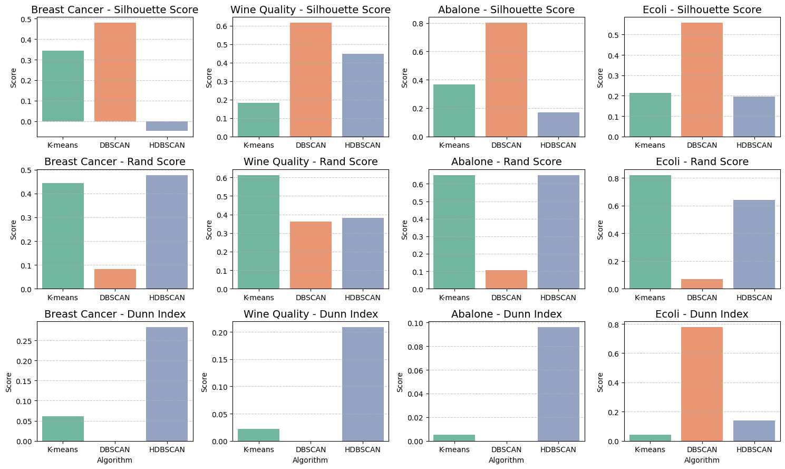
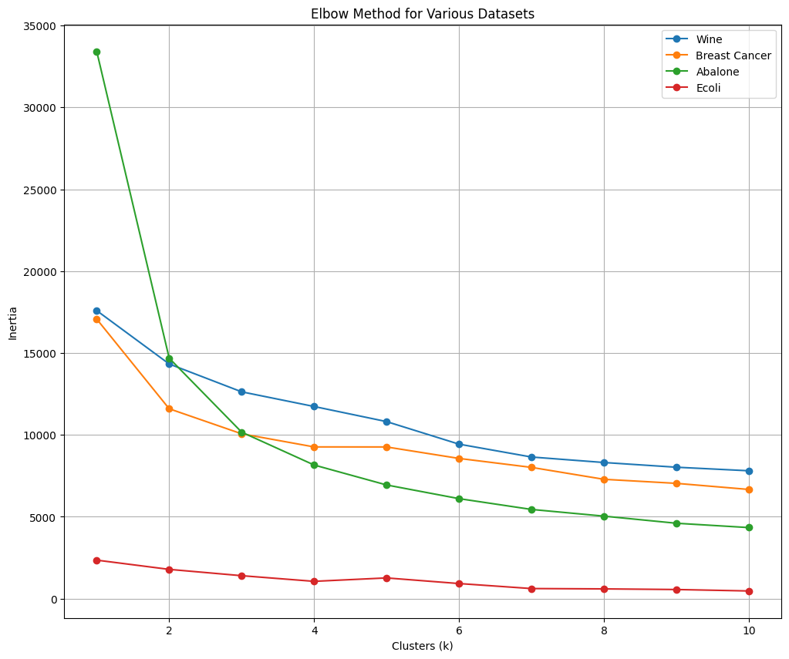

# A Comparative Study of Clustering Techniques

### Overview

This project aims to evaluate the performance of different clustering algorithms on multiple datasets. The algorithms compared are K-means, DBSCAN, and HDBSCAN. The datasets used for this analysis include Breast Cancer, Wine Quality, Abalone, and Ecoli datasets. The performance metrics used to evaluate the clustering algorithms are Silhouette Score, Rand Score, and Dunn Index.

### Datasets

The datasets used in this project are:

1. Breast Cancer Dataset: Contains features computed from a digitized image of a fine needle aspirate (FNA) of a breast mass.

2. Wine Quality Dataset: Contains various chemical tests of wines and their quality ratings.0
3. Abalone Dataset: Contains physical measurements of abalones and their age.
4. Ecoli Dataset: Contains features related to E.coli proteins and their cellular localization sites.

### Installation

To run this project, ensure you have Python installed on your system and poetry.

Clone the project:

````bash
git clone git@github.com:hericlesferraz/comparative_study_clustering_techniques.git
````

Enter inside the root project:

````bash
cd comparative_study_clustering_techniques
````

Install dependencies

````bash
poetry install
````

### Usage

Run each cell on the juyter notebook, located in and enjoy the results:

````txt
comparative_study_clustering_techniques/jupyter/comparative_study_clustering_techniques.ipynb
````

### Results

Plot results of metric in algorithms:



Plot elbow methog:


